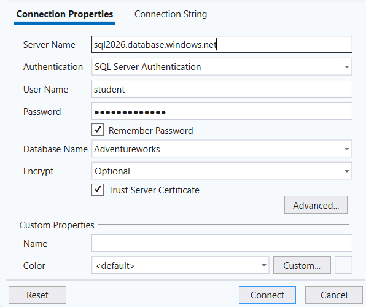

## Kapcsolódás az adatbázishoz

A feladatok megoldásához kapcsolódjon az `Adventureworks` adatbázishoz **Azure Data Studio vagy SQL Server Management Studio (SSMS)** használatával. A kapcsolat létrehozásakor az alábbi adatokat adja meg.

{fig-alt="Az AdventureWorks adatbázishoz tartozó kapcsolat beállításai Azure Data Studio vagy SSMS használatához." width=720}

::: {.callout-note title="Jelszó"}

`Password12345`

:::

::: {.callout-warning title="Otthoni elérés"}

Az adatbázis **otthonról csak Corvinus VPN-kapcsolaton keresztül érhető el**. A VPN-kapcsolatot az adatbázishoz történő csatlakozás előtt hozza létre.

:::

## Cél

A gyakorlat célja az első `SELECT` lekérdezések elkészítése az AdventureWorksLT adatbázison. A feladatok sorrendje követi az elméleti anyagot.

::: {.callout-note title="Megjegyzés"}

A lekérdezésekben elsősorban a `SalesLT.Product` táblát használjuk. A gyakorlat végén a `SalesLT.Customer` tábla is megjelenik.
:::

## SELECT és DISTINCT

### 1. feladat
Listázza a `SalesLT.Product` tábla összes adatát!
::: {.callout-tip title="Megoldás" collapse="true"}

```sql
SELECT * FROM SalesLT.Product;
```
:::

### 2. feladat
Listázza a termékek nevét (`Name`) és listaárát (`ListPrice`)!
::: {.callout-tip title="Megoldás" collapse="true"}

```sql
SELECT Name, ListPrice FROM SalesLT.Product;
```
:::

### 3. feladat
Listázza a termékek azonosítóját, nevét, színét és listaárát ebben a sorrendben!
::: {.callout-tip title="Megoldás" collapse="true"}

```sql
SELECT ProductID, Name, Color, ListPrice FROM SalesLT.Product;
```
:::

### 4. feladat
Listázza, milyen különböző színek (`Color`) fordulnak elő a termékek között!
::: {.callout-tip title="Megoldás" collapse="true"}

```sql
SELECT DISTINCT Color FROM SalesLT.Product;
```
:::

## Számított oszlopok és alias

### 5. feladat
Listázza a termék nevét és listaárát! A listaár oszlop jelenjen meg `Price` néven!
::: {.callout-tip title="Megoldás" collapse="true"}

```sql
SELECT Name, ListPrice AS Price FROM SalesLT.Product;
```
:::

### 6. feladat
Listázza a termék nevét, listaárát és a listaár 10%-kal növelt értékét `IncreasedPrice` néven!
::: {.callout-tip title="Megoldás" collapse="true"}

```sql
SELECT Name, ListPrice, ListPrice * 1.10 AS IncreasedPrice
FROM SalesLT.Product;
```
:::

### 7. feladat
Listázza a termék nevét, standard költségét és listaárát, valamint a kettő különbségét `Difference` néven!
::: {.callout-tip title="Megoldás" collapse="true"}

```sql
SELECT Name, StandardCost, ListPrice,
       ListPrice - StandardCost AS Difference
FROM SalesLT.Product;
```
:::

## Szűrés – WHERE

### 8. feladat
Listázza azokat a termékeket, amelyek listaára nagyobb 1000-nél!
::: {.callout-tip title="Megoldás" collapse="true"}

```sql
SELECT Name, ListPrice FROM SalesLT.Product
WHERE ListPrice > 1000;
```
:::

### 9. feladat
Listázza a fekete (`Black`) termékek nevét, színét és listaárát!
::: {.callout-tip title="Megoldás" collapse="true"}

```sql
SELECT Name, Color, ListPrice FROM SalesLT.Product
WHERE Color = 'Black';
```
:::

### 10. feladat
Listázza azokat a fekete termékeket, amelyek listaára nagyobb 1000-nél!
::: {.callout-tip title="Megoldás" collapse="true"}

```sql
SELECT Name, Color, ListPrice FROM SalesLT.Product
WHERE Color = 'Black' AND ListPrice > 1000;
```
:::

### 11. feladat
Listázza azokat a termékeket, amelyek színe fekete vagy piros (`Red`)!
::: {.callout-tip title="Megoldás" collapse="true"}

```sql
SELECT Name, Color, ListPrice FROM SalesLT.Product
WHERE Color = 'Black' OR Color = 'Red';
```
:::

## BETWEEN, IN és LIKE

### 12. feladat
Listázza azokat a termékeket, amelyek listaára 500 és 1000 között van!
::: {.callout-tip title="Megoldás" collapse="true"}

```sql
SELECT Name, ListPrice FROM SalesLT.Product
WHERE ListPrice BETWEEN 500 AND 1000;
```
:::

### 13. feladat
Listázza a fekete, piros vagy kék (`Blue`) termékeket! Használja az `IN` operátort!
::: {.callout-tip title="Megoldás" collapse="true"}

```sql
SELECT Name, Color, ListPrice FROM SalesLT.Product
WHERE Color IN ('Black', 'Red', 'Blue');
```
:::

### 14. feladat
Listázza azokat a termékeket, amelyek neve `Mountain` szóval kezdődik!
::: {.callout-tip title="Megoldás" collapse="true"}

```sql
SELECT Name, ListPrice FROM SalesLT.Product
WHERE Name LIKE 'Mountain%';
```
:::

### 15. feladat
Listázza azokat a termékeket, amelyek nevében bárhol szerepel a `Bike` karaktersorozat!
::: {.callout-tip title="Megoldás" collapse="true"}

```sql
SELECT Name, ListPrice FROM SalesLT.Product
WHERE Name LIKE '%Bike%';
```
:::

## NULL értékek

### 16. feladat
Listázza azokat a termékeket, amelyeknél nincs megadva szín!
::: {.callout-tip title="Megoldás" collapse="true"}

```sql
SELECT Name, Color FROM SalesLT.Product
WHERE Color IS NULL;
```
:::

### 17. feladat
Listázza azokat a termékeket, amelyeknél van megadva szín!
::: {.callout-tip title="Megoldás" collapse="true"}

```sql
SELECT Name, Color FROM SalesLT.Product
WHERE Color IS NOT NULL;
```
:::

## Rendezés

### 18. feladat
Listázza a termékek nevét és listaárát a listaár szerint csökkenő sorrendben!
::: {.callout-tip title="Megoldás" collapse="true"}

```sql
SELECT Name, ListPrice FROM SalesLT.Product
ORDER BY ListPrice DESC;
```
:::

### 19. feladat
Listázza a termékek nevét, színét és listaárát! Rendezze az eredményt először szín, azon belül listaár szerint csökkenő sorrendbe!
::: {.callout-tip title="Megoldás" collapse="true"}

```sql
SELECT Name, Color, ListPrice FROM SalesLT.Product
ORDER BY Color, ListPrice DESC;
```
:::

## Egyszerű függvények

### 20. feladat
Listázza a termékek nevét, a név hosszát `NameLength`, valamint a módosítás évét `ModifiedYear` néven!
::: {.callout-tip title="Megoldás" collapse="true"}

```sql
SELECT Name, LEN(Name) AS NameLength,
       YEAR(ModifiedDate) AS ModifiedYear
FROM SalesLT.Product;
```
:::

# Önálló gyakorlás

Az alábbi feladatoknál már Önnek kell kiválasztania a megfelelő SQL-eszközöket.

### 21. feladat
Listázza azoknak a termékeknek a nevét, színét és listaárát, amelyek színe `Black`, `Red` vagy `Silver`, és listaáruk legalább 1000! Az eredményt listaár szerint csökkenő sorrendben jelenítse meg!
::: {.callout-tip title="Megoldás" collapse="true"}

```sql
SELECT Name, Color, ListPrice FROM SalesLT.Product
WHERE Color IN ('Black', 'Red', 'Silver') AND ListPrice >= 1000
ORDER BY ListPrice DESC;
```
:::

### 22. feladat
Listázza azokat a termékeket, amelyek nevében szerepel a `Mountain` szó! Jelenítse meg a termék nevét, listaárát és a listaár 20%-kal csökkentett értékét `DiscountPrice` néven!
::: {.callout-tip title="Megoldás" collapse="true"}

```sql
SELECT Name, ListPrice, ListPrice * 0.80 AS DiscountPrice
FROM SalesLT.Product
WHERE Name LIKE '%Mountain%';
```
:::

### 23. feladat
Listázza azokat a termékeket, amelyek listaára 100 és 500 között van, és nevük `L` betűvel kezdődik! A név jelenjen meg nagybetűkkel is `UpperName` néven!
::: {.callout-tip title="Megoldás" collapse="true"}

```sql
SELECT Name, UPPER(Name) AS UpperName, ListPrice
FROM SalesLT.Product
WHERE ListPrice BETWEEN 100 AND 500 AND Name LIKE 'L%';
```
:::

### 24. feladat
Listázza a `SalesLT.Customer` táblából azoknak az ügyfeleknek a keresztnevét, vezetéknevét és cégnevét, akiknek a keresztneve `J` betűvel vagy vezetékneve `S` betűvel kezdődik! Rendezze az eredményt vezetéknév, majd keresztnév szerint!
::: {.callout-tip title="Megoldás" collapse="true"}

```sql
SELECT FirstName, LastName, CompanyName FROM SalesLT.Customer
WHERE FirstName LIKE 'J%' OR LastName LIKE 'S%'
ORDER BY LastName, FirstName;
```
:::

### 25. feladat – Challenge
Listázza azokat a `Black` vagy `Red` színű termékeket, amelyek listaára 500 és 2000 között van! Jelenítse meg nevüket, színüket, listaárukat, standard költségüket és a listaár és standard költség különbségét `PriceDifference` néven! Az eredményt a különbség szerint csökkenő sorrendben jelenítse meg!
::: {.callout-tip title="Megoldás" collapse="true"}

```sql
SELECT Name, Color, ListPrice, StandardCost,
       ListPrice - StandardCost AS PriceDifference
FROM SalesLT.Product
WHERE Color IN ('Black', 'Red')
  AND ListPrice BETWEEN 500 AND 2000
ORDER BY PriceDifference DESC;
```
:::
